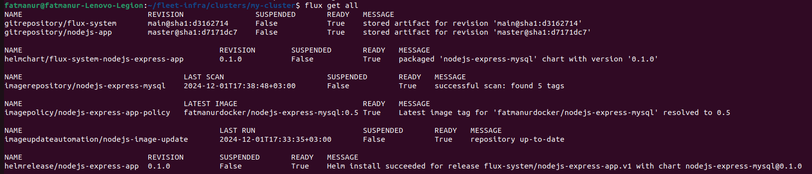

### **1. Install FluxCD CLI**

FluxCD is a tool for continuous deployment in Kubernetes, allowing the management of Kubernetes resources declaratively. Begin by installing the FluxCD CLI:

```bash
curl -s https://fluxcd.io/install.sh | sudo bash
```

Verify the installation:

```bash
flux --version
```

---

### **2. Pre-check Cluster Compatibility**

Before installing FluxCD, ensure that the cluster meets the prerequisites. Run the following command to check the compatibility:

```bash
flux check --pre
```

---

### **3. Bootstrap FluxCD**

FluxCD can be bootstrapped in a GitHub repository to automatically sync the cluster state with the repository. This setup will manage the configuration of Kubernetes resources.

#### **Basic Bootstrap**

Run the following command to bootstrap FluxCD, replacing `<your-github-username>` with the appropriate GitHub username:

```bash
flux bootstrap github \
  --owner=<your-github-username> \
  --repository=fleet-infra \
  --branch=main \
  --path=./clusters/my-cluster \
  --personal
```

#### **Custom Components**

To include additional components like `image-reflector-controller`, `image-automation-controller`, and `helm-controller`, use the following command:

```bash
flux bootstrap github \
  --owner=<your-github-username> \
  --repository=fleet-infra \
  --branch=main \
  --path=./clusters/my-cluster \
  --components=source-controller,image-reflector-controller,image-automation-controller,kustomize-controller,helm-controller
```

---

### **4. Verify Installation**

After bootstrapping Flux, verify that all Flux components are correctly installed and running:

```bash
kubectl get pods -n flux-system
```

This command checks the status of Flux components such as the source-controller, helm-controller, and image-reflector-controller.

---

### **5. Create ImageRepository for Docker Images**

An `ImageRepository` resource defines where Flux should find the Docker images. This ensures that Flux can track and manage image updates. The `ImageRepository` resource should be located in the **`fleet-infra`** repository under the **`clusters/my-cluster`** directory.

Apply it to the cluster:

```bash
kubectl apply -f clusters/my-cluster/nodejs-imagerepository.yaml
```

---

### **6. Create ImagePolicy for Image Version Control**

The `ImagePolicy` resource defines the rules for selecting the latest image version from the Docker repository. It allows Flux to automatically track the most recent image and update the application as needed.

Create the `ImagePolicy` resource and apply it:

```bash
kubectl apply -f clusters/my-cluster/nodejs-imagepolicy.yaml
```

This ensures Flux can determine which image version to use based on the specified policy (e.g., always use the latest tag).

---

### **7. Create HelmRelease for the Application**

A `HelmRelease` resource manages the deployment of applications using Helm charts. It specifies the chart version and any other necessary configurations for the application deployment.

Create the `HelmRelease` resource and apply it:

```bash
kubectl apply -f clusters/my-cluster/nodejs-helmrelease.yaml
```

---

### **8. Automate Image Update and Helm Deployment**

To automate the process of updating the HelmRelease whenever a new image is pushed, use the `ImageUpdateAutomation` controller. This controller monitors the Docker registry for updates and triggers automatic updates to the HelmRelease.

Create the `ImageUpdateAutomation` resource and apply it:

```bash
kubectl apply -f clusters/my-cluster/nodejs-imageupdateautomation.yaml
```

This step ensures that Flux will automatically detect new image tags and trigger a Helm release update.

---

### **9. Verify Updates**

To verify that the `ImageUpdateAutomation` is working correctly, check the status of the `HelmRelease` resource. The HelmRelease should reflect the updated image tag after the automation runs:

```bash
kubectl get helmrelease nodejs-express-app -n flux-system
```




